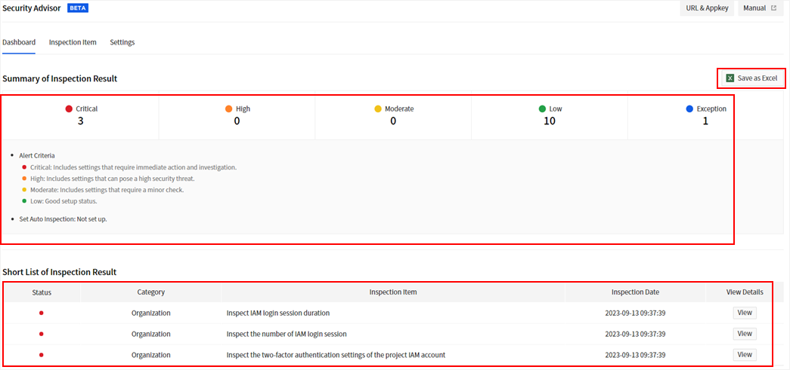
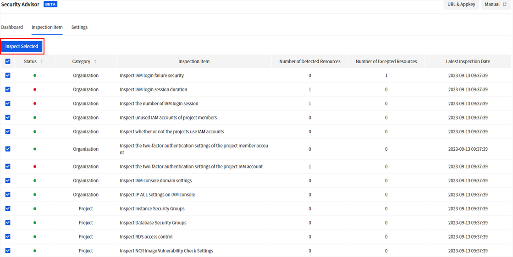
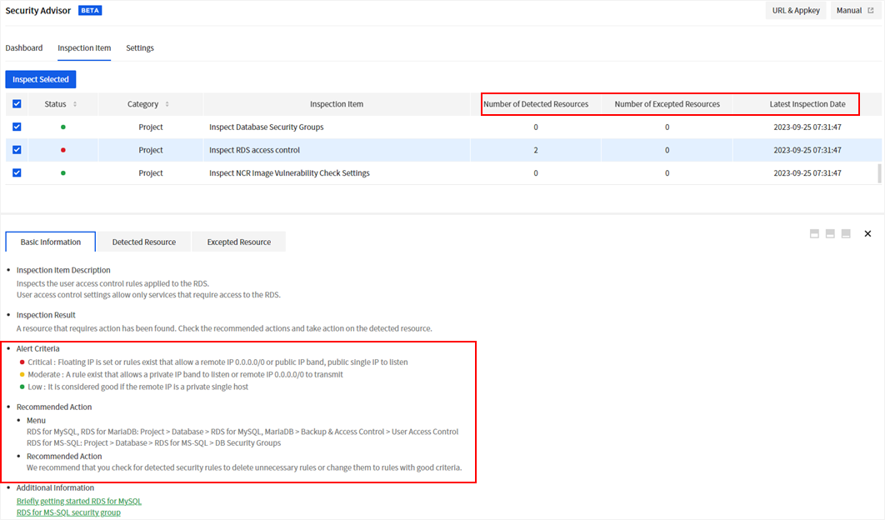
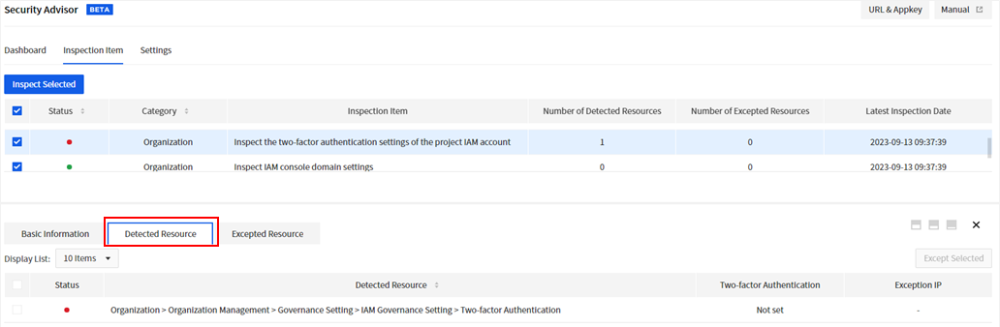
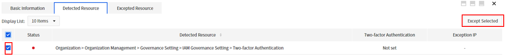
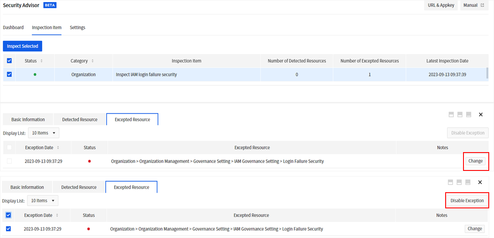
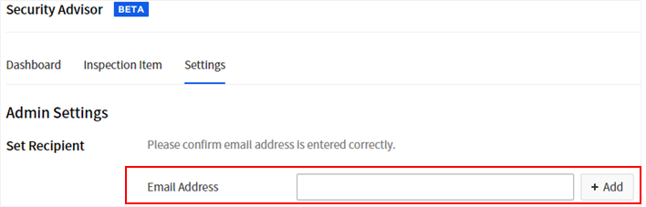
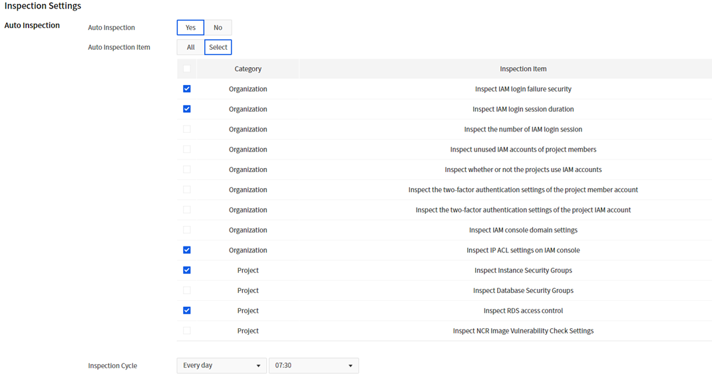

<!-- pre-align:aligned sig=39deb4ef203e -->

## Security > Security Advisor > Console Guide { #security-security-advisor-console-guide }

This document explains Security Advisor features and how to use.

## Dashboard { #dashboard }

You can check the inspection results in Inspection Item of Security Advisor.
The results of checking organizations are shown regardless of the selected region, and project resources show the results of checking resources created in the selected region.

* **Summary of Inspection Result** displays the number of inspection items by Alert Criteria.
  - **The alert criteria** described in the dashboard are the basic level of risk assessment.
The alert criteria for individual inspection items are applied differently for each item.
  - Among the detected resources in the selected inspection result, the total number of resources excluded from inspection is displayed in exception.
  - The auto inspection setting displays the inspection cycle set in the settings menu.
* **Short List of Inspection Result** displays the items of detected resources with Critical, High, Moderate, and Low criteria.
  - Inspection results in the **Low** state are not displayed.
  - Click **View** on View Details to move to the inspection item page and check detailed information.
* Click **Save as Excel** to download the inspection results to an excel file.
  - The Excel file stores the results of the last selected inspection item (basic information of the inspection item, detected resources, and inspection time).
  - The Excel file does not include excepted resources and configuration information.
  - If there is no inspection result because the selected inspection has not been performed even once after activating the service, the Excel file can be downloaded, but cannot open.

## Inspection Item { #inspection-item }

You can run inspection by selecting inspection items and get the result and recommended actions.
You can check the details of inspection results and exclude unnecessary items from inspection.

### Selected Inspection { #selected-inspection }
1. Select the region to inspect.
(The items classified by organization are equally applied to all regions, so changing regions will have the same results.)
2. Check items to inspect and click **Inspect Selected**.
3. Once the inspection is complete, check the results for each inspection item.
4. For items classified by project, change the region and perform selected inspection.

### Basic Information { #basic-information }

* Provides descriptions of the inspection items.
* You can check the number of detected resources and excepted resources, and last inspection date.
* Allows you to confirm alert criteria and take action on detected resources through recommendations.

### Detected Resource { #detected-resource }

* You can view the details of the resources detected based on the alert criteria for each item.
* If you check any of the detected resources and click **Except Selected**, those resources will be excluded on the next inspection.

### Exception List { #exception-list }

* You can find the items excluded from inspection.
* You can write a note by clicking **Change**.
* If you check any of the excluded items and click **Disable Exception**, the item can be included in inspection.

## Settings { #settings }

You can run inspection periodically at a desired time by setting up auto inspection.
If you enter an email address, the auto inspection result is sent to the address. When you set up auto inspection but don’t enter an email address, the inspection result is reflected only in the console.
After change the settings, must click **Save** to apply the changes.

### Admin Settings { #admin-settings }

* Set the email address of the administrator who will receive the inspection results. Make sure to enter the email address correctly.
* The email is not a required field.

### Inspection Settings { #inspection-settings }
* You can enable auto inspection by setting **Inspection Cycle**. The inspection result is automatically reflected in the console, and sent to the email address if set.
* You can select **Auto Inspection Item**.

